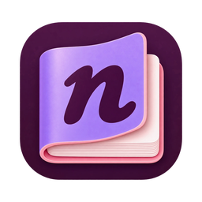
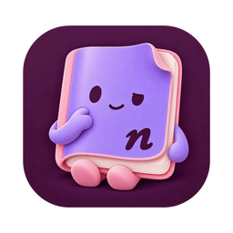

  

<h1 align="center">Notie</h1>

  <b>Doodle on the web. Keep every note in one cozy place.</b> 
  Draw, highlight and stick notes on any website. They're still there when you come back, 
  and the Notie app collects them all, from every browser.

  <a href="https://github.com/berkboz/notie-releases/releases/latest/download/Notie-mac.dmg"><b>⬇ Download for Mac</b></a>
  &nbsp;·&nbsp;
  <a href="https://github.com/berkboz/notie-releases/releases/latest/download/Notie-windows-setup.exe"><b>⬇ Download for Windows</b></a>
  &nbsp;·&nbsp;
  <a href="https://github.com/berkboz/notie-releases/releases/latest">All downloads</a>

🧪 Friends &amp; family beta. Thanks for trying it out! 💜

---

## ✨ What it does

| | |
|---|---|
| 🖊️ **Draw anywhere** | Pen, highlighter, lines, arrows, boxes and circles, right on top of any page. |
| 🗒️ **Notes that stay** | Sticky notes, text and speech bubbles with 5 fonts, sizes, bold and italic. |
| 🔁 **They come back** | Reopen the page and your notes are exactly where you left them. |
| 📚 **One library** | The desktop app shows every note from every browser: which page, which link, when. Search it all. |
| 🔒 **Private** | Everything stays on your computer. No accounts, no servers, no tracking. |
| 🆙 **Updates itself** | The app tells you when a new version is ready, and updating takes one click. |

## 🚀 Getting started

1. **Install the app** from the links above.
2. **Open Notie.** It finds your browsers and walks you through adding the extension. One step each.
3. **Go to any website and press <kbd>⌥ Option</kbd> + <kbd>D</kbd>** (or click the Notie button in the toolbar). Start doodling!

<b>🍎 Mac says "can't be opened" or "unidentified developer"?</b>

 Notie isn't signed with an Apple developer certificate yet (beta life 🙈). It's safe, you just have to allow it once:

1. Right-click (or Control-click) **Notie** in Applications → **Open** → **Open**.
2. If that doesn't show an Open button: **System Settings → Privacy & Security** → scroll down → **Open Anyway**.

You only do this once. Updates install without asking.

<b>🪟 Windows shows "Windows protected your PC"?</b>

 Same reason: no code-signing certificate yet. Click **More info → Run anyway**. Only the first time.

<b>🧩 Installing the extension by hand</b>

 The app does this for you, but in case you need it, grab the file for your browser from <a href="https://github.com/berkboz/notie-releases/releases/latest">the latest release</a>:

| Browser | File | How |
|---|---|---|
| Zen, Firefox | `notie-firefox-*.xpi` | Drag the file into the browser window → **Add**. |
| Chrome, Edge, Brave, Arc, Opera, Vivaldi | `notie-<browser>-*.zip` | Unzip, open the browser's extensions page, turn on **Developer mode**, click **Load unpacked**, pick the folder. |

Store versions are on the way, and then it'll be one click.

## ⌨️ Shortcuts

| Key | Tool | | Key | Tool |
|---|---|---|---|---|
| <kbd>⌥D</kbd> | Show / hide toolbar | | <kbd>T</kbd> | Text |
| <kbd>V</kbd> | Select & move | | <kbd>S</kbd> | Sticky note |
| <kbd>P</kbd> | Pen | | <kbd>B</kbd> | Speech bubble |
| <kbd>M</kbd> | Highlighter | | <kbd>E</kbd> | Eraser |
| <kbd>L</kbd> / <kbd>A</kbd> | Line / Arrow | | <kbd>⌘Z</kbd> | Undo |
| <kbd>R</kbd> / <kbd>O</kbd> | Box / Circle | | <kbd>Esc</kbd> | Back to browsing |

Hold <kbd>⇧ Shift</kbd> for straight lines, perfect squares and circles.

## 🎨 Two moods

The app comes with two icons. Pick yours at the bottom of the sidebar.

   &nbsp;
  

## 💬 Feedback

Found a bug or have an idea? Tell Berk directly, or [open an issue](https://github.com/berkboz/notie-releases/issues). Screenshots are always welcome.

---

### 🇹🇷 Kısaca Türkçe

1. Yukarıdan **Mac** ya da **Windows** sürümünü indir ve kur.
2. Notie'yi aç. Tarayıcılarını bulup eklentiyi kurmana adım adım yardım eder.
3. Herhangi bir sitede **⌥ Option + D**'ye bas ve çizmeye başla.

Mac "açılamıyor" derse: Uygulamalar'da Notie'ye sağ tık → **Aç**. Windows uyarı verirse: **Ek bilgi → Yine de çalıştır**. Bu sadece ilk seferde olur.

Made with 💜 for friends &amp; family

